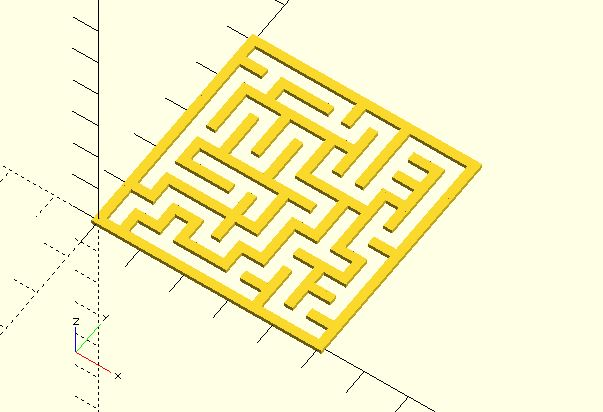
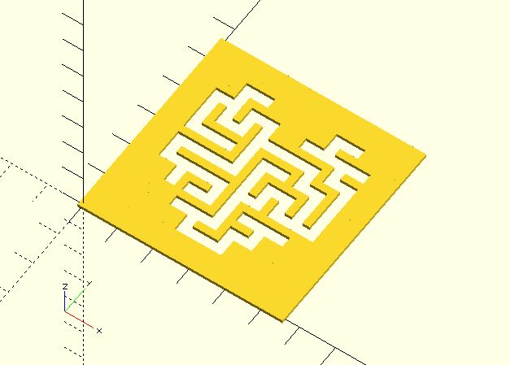
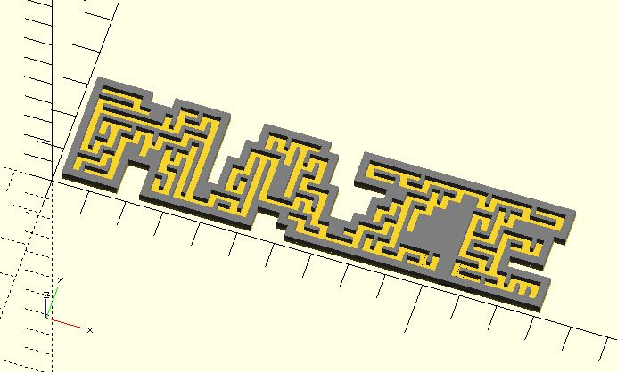

# mz_square_initialize

It's a helper for initializing cell data of a maze. 

**Since:** 2.5

## Parameters

- `rows` : The rows of the maze.
- `columns` : The columns of the maze.
- `mask` : The mask for a maze. A list of 0s and 1s. Cells makred as 0 won't be traveled.

## Examples
    
	use <maze/mz_square_initialize.scad>;
	use <maze/mz_square_cells.scad>;
	use <maze/mz_square_walls.scad>;
	use <polyline2d.scad>;

	rows = 10;
	columns = 10;
	cell_width = 5;
	wall_thickness = 2;

    init_cells = mz_square_initialize(rows, columns);
	cells = mz_square_cells(rows, columns, init_cells = init_cells);
	walls = mz_square_walls(cells, rows, columns, cell_width);

	for(wall = walls) {
		polyline2d(wall, wall_thickness, joinStyle = "JOIN_MITER");
	}
	

    use <maze/mz_square_cells.scad>;
    use <maze/mz_square_walls.scad>;
    use <maze/mz_square_initialize.scad>;
    use <polyline2d.scad>;

    mask = [
        [0, 0, 0, 0, 0, 0, 0, 0, 0, 0, 0],
        [0, 0, 1, 1, 0, 0, 0, 1, 1, 0, 0],
        [0, 1, 1, 1, 1, 0, 1, 1, 1, 1, 0],
        [0, 1, 1, 1, 1, 1, 1, 1, 1, 1, 0],
        [0, 1, 1, 1, 1, 1, 1, 1, 1, 1, 0],
        [0, 1, 1, 1, 1, 1, 1, 1, 1, 1, 0],
        [0, 1, 1, 1, 1, 1, 1, 1, 1, 1, 0],
        [0, 0, 1, 1, 1, 1, 1, 1, 1, 0, 0],
        [0, 0, 0, 1, 1, 1, 1, 1, 0, 0, 0],
        [0, 0, 0, 0, 1, 1, 1, 0, 0, 0, 0],
        [0, 0, 0, 0, 0, 0, 0, 0, 0, 0, 0]
    ];
    start = [3, 3];
    cell_width = 5;
    wall_thickness = 2;

    rows = len(mask);
    columns = len(mask[0]);
    init_cells = mz_square_initialize(mask = mask);
    cells = mz_square_cells(rows, columns, start, init_cells);
    walls = mz_square_walls(cells, rows, columns, cell_width, false, false);

    // Maze
    for(wall = walls) {
        polyline2d(wall, wall_thickness, joinStyle = "JOIN_MITER");
    }

    // Mask
    mask_width = cell_width + wall_thickness;
    translate([-wall_thickness / 2, -wall_thickness / 2])
    for(i = [0:rows - 1]) {
        for(j = [0:columns - 1]) {
                if(mask[i][j] == 0) {
                    translate([cell_width * j, cell_width * (rows - i - 1)])
                        square(mask_width);
                }
        }
    }
	

 I provide a tool [img2binary](https://github.com/JustinSDK/img2binary) for converting an image into 0 and 1. 0 is for black and 1 is for white. You may use it to create a mask from an image. The mask of [maze_masking](https://github.com/JustinSDK/dotSCAD/blob/master/examples/maze/maze_masking.scad) is an example.

