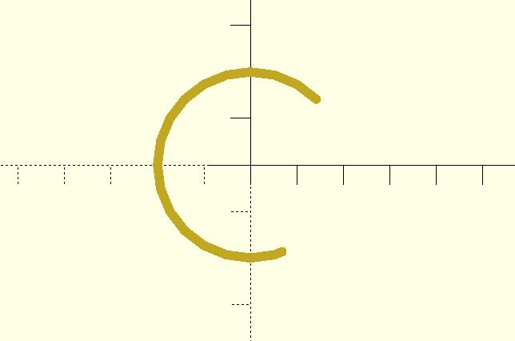
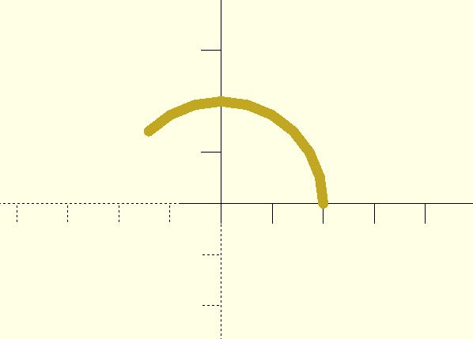

# arc_path

Creates an arc path. You can pass a 2 element vector to define the central angle. Its `$fa`, `$fs` and `$fn` parameters are consistent with the `circle` module. 

## Parameters

- `radius` : The radius of the circle.
- `angle` : A single value or a 2 element vector which defines the central angle. The first element of the vector is the beginning angle in degrees, and the second element is the ending angle.
- `$fa`, `$fs`, `$fn` : Check [the circle module](https://en.wikibooks.org/wiki/OpenSCAD_User_Manual/Using_the_2D_Subsystem#circle) for more details.

## Examples
  
	use <arc_path.scad>;
	use <polyline_join.scad>;

	$fn = 24;
	points = arc_path(radius = 20, angle = [45, 290]);
	polyline_join(points) circle(1);

    use <arc_path.scad>;
    use <polyline_join.scad>;
    
    $fn = 24;
    points = arc_path(radius = 20, angle = 135);
    polyline_join(points) circle(1);

