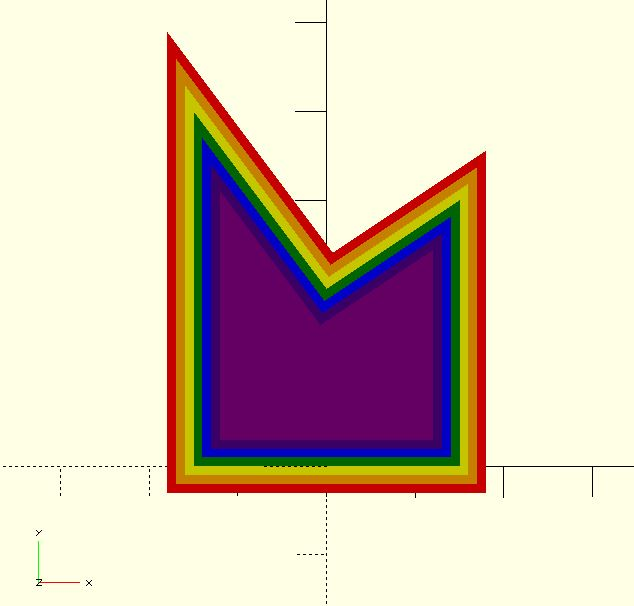
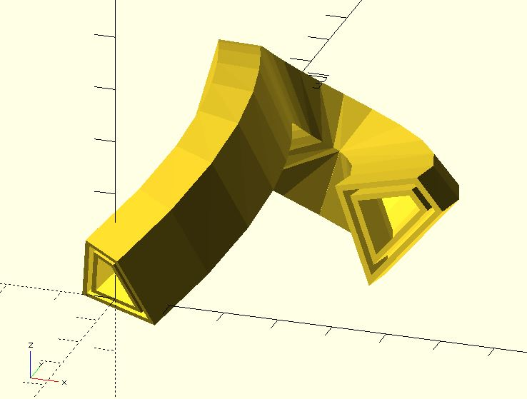

# bijection_offset

Move 2D outlines outward or inward by a given amount. Each point of the offsetted shape is paired with exactly one point of the original shape.

**Since:** 1.2.

## Parameters

- `pts` : Points of a shape.
- `d` : Amount to offset the shape. When negative, the shape is offset inwards. 
- `epsilon` : An upper bound on the relative error due to rounding in floating point arithmetic. Default to 0.0001. **Since:** 1.3.

## Examples

	use <bijection_offset.scad>;

	shape = [
		[15, 0],
		[15, 30],
		[0, 20],
		[-15, 40],
		[-15, 0]
	];

	color("red")    polygon(bijection_offset(shape, 3));
	color("orange") polygon(bijection_offset(shape, 2));
	color("yellow") polygon(bijection_offset(shape, 1));
	color("green")  polygon(shape);
	color("blue")   polygon(bijection_offset(shape, -1));
	color("indigo") polygon(bijection_offset(shape, -2));
	color("purple") polygon(bijection_offset(shape, -3));

	use <bijection_offset.scad>;
	use <path_extrude.scad>;
	use <bezier_curve.scad>;

	shape = [
		[5, 0],
		[3, 9],
		[0, 10],    
		[-5, 0]
	];
	offsetted = bijection_offset(shape, 1);
	offsetted2 = bijection_offset(shape, 2);
	offsetted3 = bijection_offset(shape, 3);

	t_step = 0.05;

	p0 = [0, 0, 0];
	p1 = [40, 60, 35];
	p2 = [-50, 70, 0];
	p3 = [20, 150, -35];
	p4 = [30, 50, -3];

	path_pts = bezier_curve(t_step, 
		[p0, p1, p2, p3, p4]
	);

	path_extrude(concat(offsetted, shape), path_pts, "HOLLOW");
	path_extrude(concat(offsetted3, offsetted2), path_pts, "HOLLOW");

