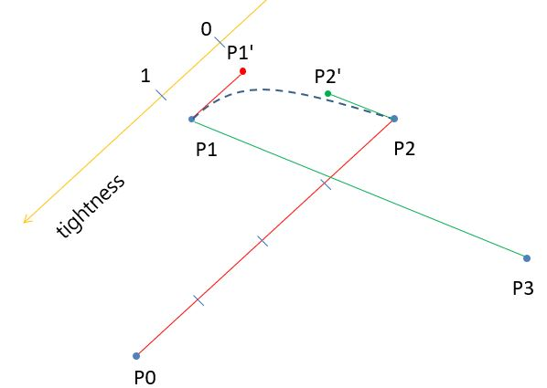
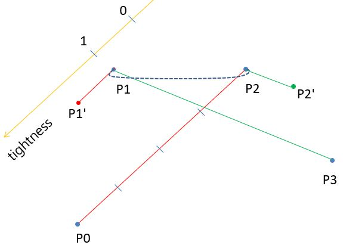
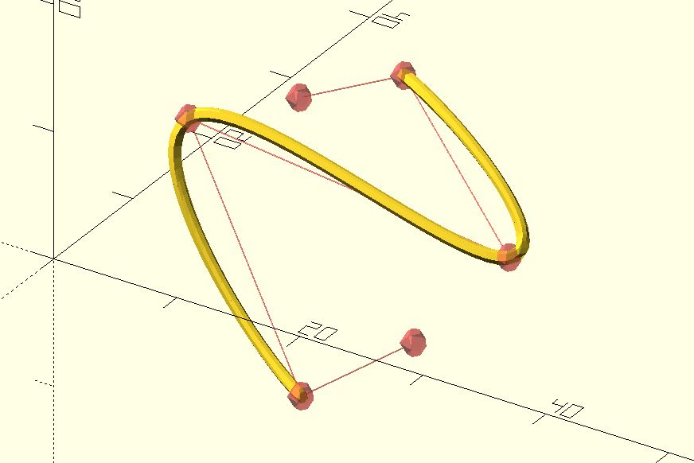

# curve

Draws a curved line from control points. The curve is drawn only from the 2nd control point to the second-last control point. It's an implementation of [Centripetal Catmull-Rom spline](https://en.wikipedia.org/wiki/Centripetal_Catmull%E2%80%93Rom_spline). 

**Since:** 2.5

## Parameters

- `t_step` : The distance between two points of the generated curve.
- `points` : A list of `[x, y]` or `[x, y, z]` control points.
- `tightness` : You can view it as the curve tigntness if you provide a value between 0.0 and 1.0. The default value is 0.0. The value 1.0 connects all the points with straight lines. The value greater than 1.0 or less than 0.0 is also acceptable because it defines how to generate a bezier curve every four control points.

## Examples

	use <curve.scad>;
	use <hull_polyline3d.scad>;

	pts = [
		[28, 2, 1],
		[15, 8, -10],
		[2, 14, 5],
		[28, 14, 2],
		[15, 21, 9],
		[2, 28, 0]
	];

	t_step = 0.05;    
	tightness = 0;
	points = curve(t_step, pts, tightness);

	hull_polyline3d(points, 1);   

	#for(pt = pts) {
		translate(pt)
			sphere(1);
	}
	#hull_polyline3d(pts, .1);  

