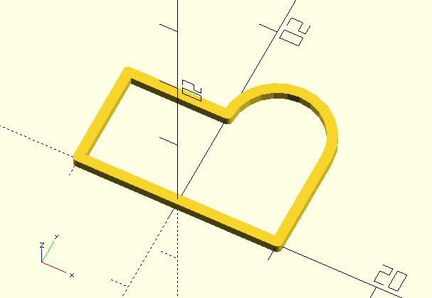

# footprints2

Drive a turtle with `["forward", length]` or `["turn", angle]`. This function is intended to use a turtle to imitate freehand drawing. 

**Since:** 2.4

## Parameters

- `cmds` : A list of `["forward", length]`s and `["turn", angle]`s.
- `start` : Set the start point of the turtle. Default to `[0, 0]`.

## Examples
	    
	use <polyline_join.scad>;
	use <turtle/footprints2.scad>;
	
	function arc_cmds(radius, angle, steps) = 
		let(
			fa = angle / steps,
			ta = fa / 2,
			leng = sin(ta) * radius * 2
		)
		concat(
			[["turn", ta]],
			[
				for(i = [0:steps - 2])
				each [["forward", leng], ["turn", fa]]
			],
			[["forward", leng], ["turn", ta]]
		);
		
	poly = footprints2(
		concat(
			[
				["forward", 10],
				["turn", 90],
				["forward", 10] 
			], 
			arc_cmds(5, 180, 12),
			[
				["turn", -90],
				["forward", 10],
				["turn", 90],
				["forward", 10],
				["turn", 90],
				["forward", 10]
			]
		)
	);

	polyline_join(poly)
	    circle(.5);

