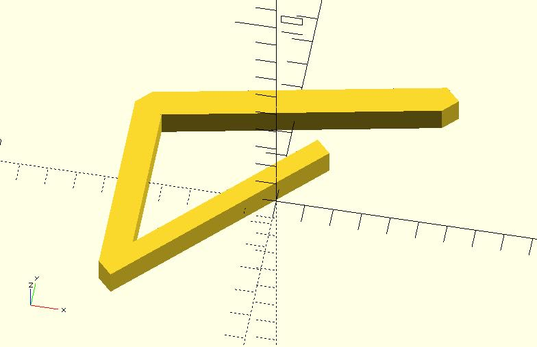

# hull_polyline2d

Creates a 2D polyline from a list of `[x, y]` coordinates. As the name says, it uses the built-in hull operation for each pair of points (created by the `circle` module). It's slow. However, it can be used to create metallic effects for a small `$fn`, large `$fa` or `$fs`.

## Parameters

- `points` : The list of `[x, y]` points of the polyline. The points are indexed from 0 to n-1.
- `width` : The line width.
- `$fa`, `$fs`, `$fn` : Check [the circle module](https://en.wikibooks.org/wiki/OpenSCAD_User_Manual/Using_the_2D_Subsystem#circle) for more details.

## Examples

	use <hull_polyline2d.scad>;
	
	$fn = 4;
	
	hull_polyline2d(
	    points = [[1, 2], [-5, -4], [-5, 3], [5, 5]], 
	    width = 1
	);

