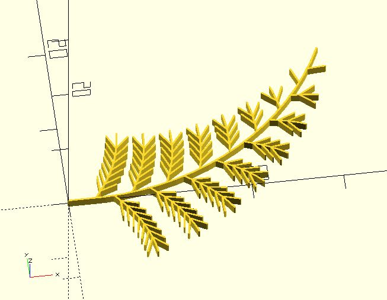
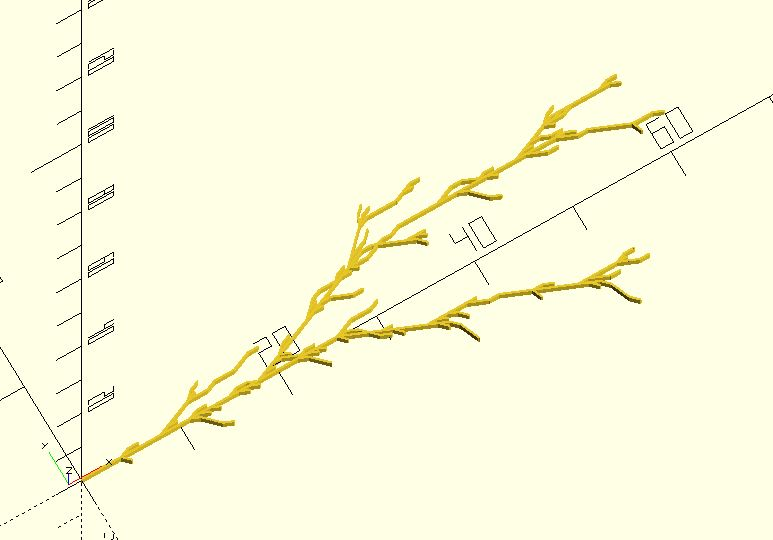
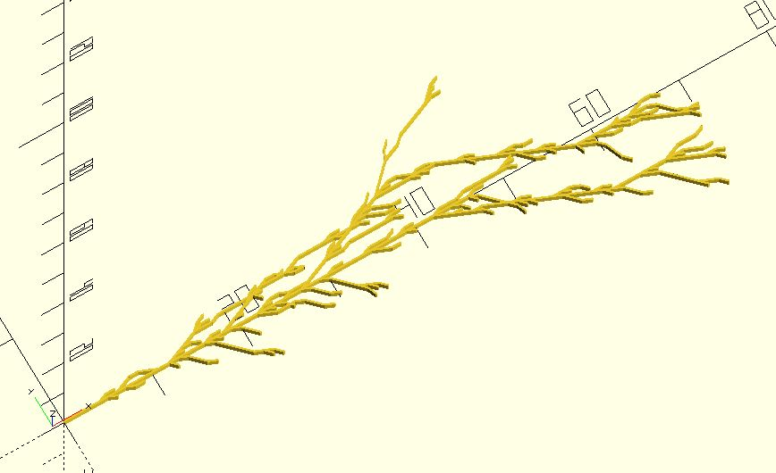

# lsystem2

`lsystem2` is a 2D implementation of [L-system](https://en.wikipedia.org/wiki/L-system). It's based on the algorithm of turtle grahpics. Instructions for generation of rules are as follows:

	F  Move forward and draw line
	f  Move forward without drawing a line
	+  Turn left
	-  Turn right 
	|  Reverse direction (ie: turn by 180 degrees)
	[  Push current turtle state onto stack
	]  Pop current turtle state from the stack

**Since:** 2.4

## Parameters

- `axiom` : The initial state of the system.
- `rules` : A list of production rules. The first element of each rule is the predecessor, and the second is the successor.
- `n` : Iteration times.
- `angle` : Used when turing.
- `leng` : Used when forwarding. Default to `1`.
- `heading` : The initial angle of the turtle. Default to `0`.
- `start` : The starting point of the turtle. Default to `[0, 0]`.
- `forward_chars` : Chars used for forwarding after the last iteration. Default to `'F'`. 
- `rule_prs` : The probabilities for taking rules. If each rule is chosen with a certain probability, it's a stochastic L-system. Each probability value for a rule ranges from 0 to 1.

## Examples

[lsystem2-collections.scad](https://github.com/JustinSDK/dotSCAD/blob/master/examples/turtle/lsystem2_collection.scad) collects several L-system grammars. Here's one of them.

	use <turtle/lsystem2.scad>
	use <line2d.scad>

	for(line = fern()) {
		line2d(
			line[0],
			line[1],
			.2,
			p1Style = "CAP_ROUND", 
			p2Style =  "CAP_ROUND"
		);
	}

	function fern(n = 8, angle = 4, leng = 1, heading = 0, start = [0, 0]) = 
		let(
			axiom = "EEEA",
			rules = [
				["A", "[++++++++++++++EC]B+B[--------------ED]B+BA"],
				["C", "[---------EE][+++++++++EE]B+C"],
				["D", "[---------EE][+++++++++EE]B-D"]
			]
		)
		lsystem2(axiom, rules, n, angle, leng, heading, start, forward_chars = "ABCDE");  

    // a stochastic L-system

	use <turtle/lsystem2.scad>
	use <line2d.scad>

	for(line = weed()) {
		line2d(
			line[0],
			line[1],
			.2,
			p1Style = "CAP_ROUND", 
			p2Style =  "CAP_ROUND"
		);
	}

	function weed(n = 6, angle = 22.5, leng = 1, heading = 0, start = [0, 0]) = 
		let(
			axiom = "F",
			rules = [
				["F", "FF-[XY]+[XY]"],
				["X", "+FY"],
				["Y", "-FX"]
			]
		)
		lsystem2(axiom, rules, n, angle, leng, heading, start, rule_prs = [0.8, 0.8, 0.8]);

