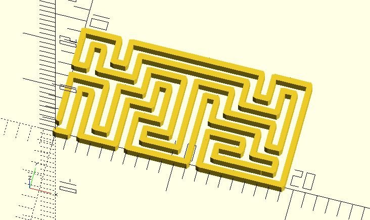
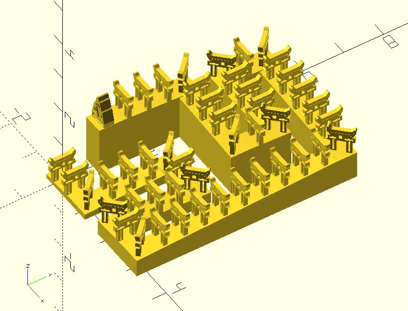

# mz_hamiltonian

Creates a hamiltonian path from a maze. The path is the result of maze traversal using [Wall follower](https://en.wikipedia.org/wiki/Maze_solving_algorithm#Wall_follower).

**Since:** 2.5

## Parameters

- `rows` : The rows of a maze.
- `columns` : The columns of a maze.
- `start` : The start point to travel the maze. Default to `[0, 0]`.
- `seed` : The maze is traveling randomly. Use `seed` to initialize the pseudorandom number generator.

## Examples
    
    use <maze/mz_hamiltonian.scad>;
    use <hull_polyline2d.scad>;

    rows = 5;
    columns = 10;

    path = mz_hamiltonian(rows, columns, [0, 0]);
    hull_polyline2d(path, .5);

The [senbon_torii](https://github.com/JustinSDK/dotSCAD/blob/master/examples/maze/senbon_torii.scad) is based on `mz_hamiltonian`.

