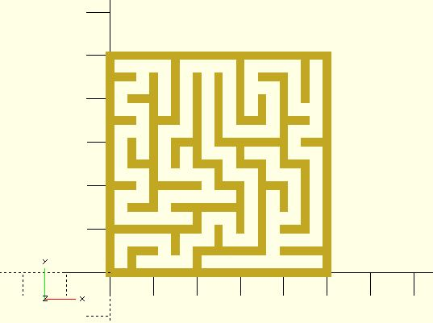

# mz_square_cells

This function returns cell data of a square maze. The data is a list of cells. A cell has the data structure `[x, y, type, visited]`. `x` and `y` are 0-based. `x` means x-th column and `y` means y-th row for a cell. The value of `type` can be `0`, `1`, ``2`, `3` or `4`. Setting them to constants is convenient.

	NO_WALL = 0;       
	TOP_WALL = 1;    
	RIGHT_WALL = 2;    
	TOP_RIGHT_WALL = 3; 
	MASK = 4;

The cell data is seperated from views. You can use cell data to construct [different types of mazes](https://www.thingiverse.com/justinsdk/collections/maze-generator).

**Since:** 2.5

## Parameters

- `rows` : The number of rows.
- `columns` : The number of columns.
- `start` : The start point to travel the maze. Default to `[0, 0]`.
- `init_cells` : You can define your own initial cell data, a list of `[x, y, type, visited]`s. `visited` means the cell is visited or not. A visited cell won't be visited when traveling the maze. If you don't provide `init_cells`, `mz_square_cells` will generate one automatically.
- `x_wrapping` : Default to `false`. If you want to wrap the maze in the x direction, set it to `true`. The last column of cells will be adjacent to the first column of cells.
- `y_wrapping` : Default to `false`. If you want to wrap the maze in the y direction, set it to `true`. The last row of cells will be adjacent to the first row of cells.
- `seed` : The maze is traveling randomly. Use `seed` to initialize the pseudorandom number generator.

## Examples
    
	use <maze/mz_square_cells.scad>;
	use <line2d.scad>;

	rows = 10;
	columns = 10;
	cell_width = 5;
	wall_thickness = 2;

	NO_WALL = 0;       
	TOP_WALL = 1;    
	RIGHT_WALL = 2;    
	TOP_RIGHT_WALL = 3; 
	MASK = 4;

	cells = mz_square_cells(rows, columns);

	for(cell = cells) {
		x = cell[0];
		y = cell[1];
		type = cell[2];
		
		translate([x, y] * cell_width) {
			if(type == TOP_WALL || type == TOP_RIGHT_WALL) {
				line2d([0, cell_width], [cell_width, cell_width], wall_thickness);
			}
			
			if(type == RIGHT_WALL || type == TOP_RIGHT_WALL) {
				line2d([cell_width, cell_width], [cell_width, 0], wall_thickness);
			}	
		}
	}

	line2d([0, 0], [cell_width * rows, 0], wall_thickness);
	line2d([0, 0], [0, cell_width * columns], wall_thickness);

