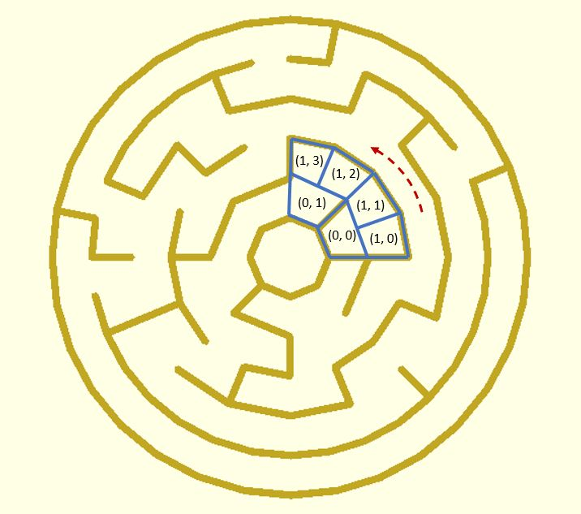
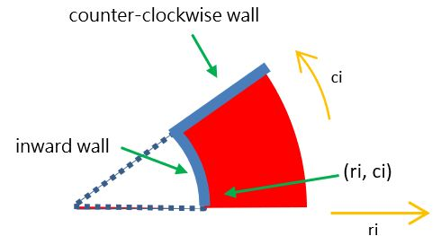

# mz_theta_cells

This function returns cell data of a theta maze. The data is a two-dimensional list with different row lengths. A cell has the data structure `[ri, ci, type]`. `ri` and `ci` are 0-based. `ri` means the ri-th ring and `ci` means the ci-th (counter-clockwise) cell of the ring. 

The value of `type` is the wall type of the cell. It can be `0`, `1`, `2` or `3`. Setting them to constants is convenient.

	NO_WALL = 0;           // the cell has no wall
	INWARD_WALL = 1;       // the cell has an inward wall
	CCW_WALL = 2;          // the cell has a counter-clockwise wall
	INWARD_CCW_WALL = 3;   // the cell has an inward wall and a clockwise wall

**Since:** 3.0

## Parameters

- `rows` : The number of rings.
- `beginning_number` : The number of cells in the first row.
- `start` : The start point to travel the maze. Default to `[0, 0]`.
- `seed` : The maze is traveling randomly. Use `seed` to initialize the pseudorandom number generator.

## Examples
    
	use <maze/mz_theta_cells.scad>;
	use <polyline_join.scad>;

	rows = 8;
	beginning_number = 8;
	cell_width = 10;
	wall_thickness = 2;

	NO_WALL = 0;           
	INWARD_WALL = 1;      
	CCW_WALL = 2;         
	INWARD_CCW_WALL = 3;   

	function vt_from_angle(theta, r) = [r * cos(theta), r * sin(theta)];

	maze = mz_theta_cells(rows, beginning_number);

	// draw cell walls
	for(rows = maze) {
		for(cell = rows) {
			ri = cell[0];
			ci = cell[1];
			type = cell[2];
			thetaStep = 360 / len(maze[ri]);
			innerR = (ri + 1) * cell_width;
			outerR = (ri + 2) * cell_width;
			theta1 = thetaStep * ci;
			theta2 = thetaStep * (ci + 1);
			
			innerVt1 = vt_from_angle(theta1, innerR);
			innerVt2 = vt_from_angle(theta2, innerR);
			outerVt2 = vt_from_angle(theta2, outerR);
			
			if(type == INWARD_WALL || type == INWARD_CCW_WALL) {
				polyline_join([innerVt1, innerVt2])
				    circle(wall_thickness / 2);
			}

			if(type == CCW_WALL || type == INWARD_CCW_WALL) {
				polyline_join([innerVt1, innerVt2])
				    circle(wall_thickness / 2);
			}
		} 
	}

    // outmost walls
	thetaStep = 360 / len(maze[rows - 1]);
	r = cell_width * (rows + 1);
	for(theta = [0:thetaStep:360 - thetaStep]) {
		vt1 = vt_from_angle(theta, r);
		vt2 = vt_from_angle(theta + thetaStep, r);
		polyline_join([vt1, vt2])
			circle(wall_thickness / 2);
	} 

