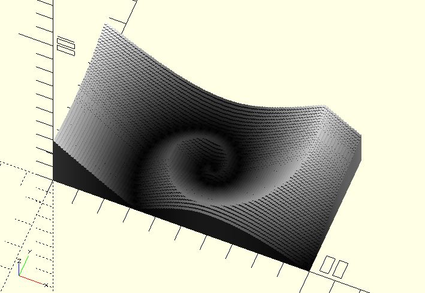
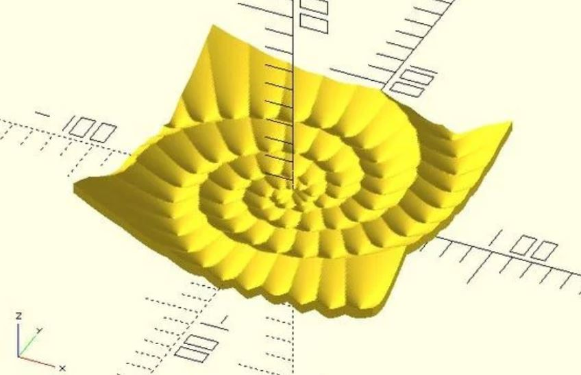

# nz_cell

It's an implementation of [Worley noise](https://en.wikipedia.org/wiki/Worley_noise). The feature points can be customized. The function returns `[cell_x, cell_y(, cell_z), noise]` value at the (x, y(,z)) coordinate. 

**Since:** 2.3

## Parameters

- `points` : The feature points, can be 2D or 3D. 
- `p` : The pixel or voxel coordinate.
- `dist` : The noise value of each point is based on its distance to other cells. Different distance strategies make different noises. The `dist` parameter accepts `"euclidean"`, `"manhattan"`, `"chebyshev"` or `"border"`.

## Examples

    use <noise/nz_cell.scad>;
    use <golden_spiral.scad>;

    size = [100, 50];
    half_size = size / 2;

    pts_angles = golden_spiral(
        from = 3, 
        to = 10, 
        point_distance = 3
    );

    feature_points = [for(pt_angle = pts_angles) pt_angle[0] + half_size];
    noised = [
        for(y = [0:size.y - 1], x = [0:size.x - 1]) 
        [x, y, nz_cell(feature_points, [x, y])]
    ];

    max_dist = max([for(n = noised) n[2]]);

    for(n = noised) {
        c = abs(n[2] / max_dist);
        color([c, c, c])
        linear_extrude(n[2] + 0.1)
        translate([n[0], n[1]])
            square(1);
    }

You can build a model such as [voronoi_fibonacci2](https://github.com/JustinSDK/dotSCAD/blob/master/examples/voronoi/voronoi_fibonacci2.scad):

