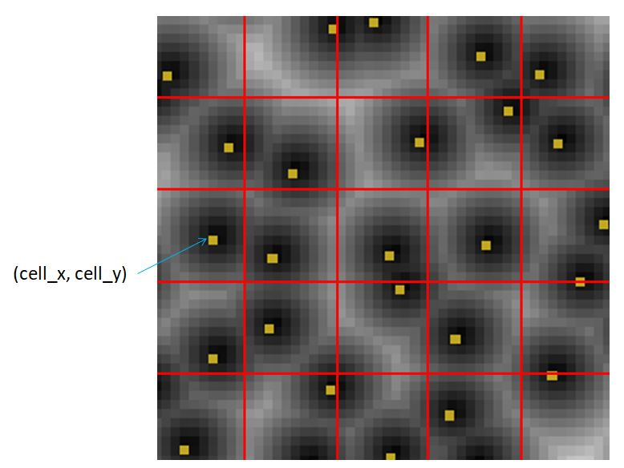
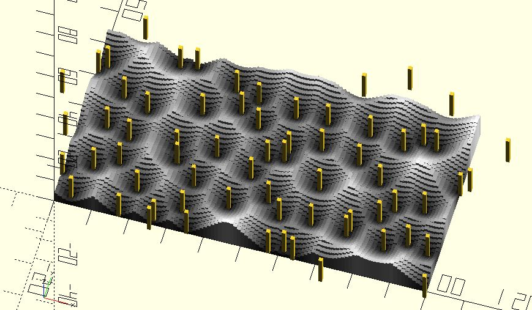

# nz_worley2

Returns the 2D [Worley noise](https://en.wikipedia.org/wiki/Worley_noise) value `[cell_x, cell_y, noise]` at the (x, y) coordinate. 

It divides the space into grids. The nucleus of each cell is randomly placed in a grid. 

**Since:** 2.3

## Parameters

- `x` : The x coordinate.
- `y` : The y coordinate.
- `seed` : The random seed.
- `grid_w` : The grid width. Default to 10. Smaller `grid_w` makes more cells.
- `dist` : The noise value of each point is based on its distance to other cells. Different distance strategies make different noises. The `dist` parameter accepts `"euclidean"`, `"manhattan"`, `"chebyshev"` or `"border"`.

## Examples

    use <noise/nz_worley2.scad>;
    use <util/dedup.scad>;

    size = [100, 50];
    grid_w = 10;
    dist = "euclidean"; // [euclidean, manhattan, chebyshev, border] 
    seed = 51;

    points = [
        for(y = [0:size[1] - 1]) 
            for(x = [0:size[0] - 1]) 
                [x, y]
    ];

    cells = [for(p = points) nz_worley2(p[0], p[1], seed, grid_w, dist)];

    max_dist = max([for(c = cells) c[2]]);
    for(i = [0:len(cells) - 1]) {
        c = cells[i][2] / max_dist;
        color([c, c, c])
        linear_extrude(cells[i][2])
        translate(points[i])
            square(1);
    }

    cells_pts = dedup([for(c = cells) [c[0], c[1]]]);
    for(p = cells_pts) {
        translate(p)
        linear_extrude(max_dist)
            square(1);
    }

