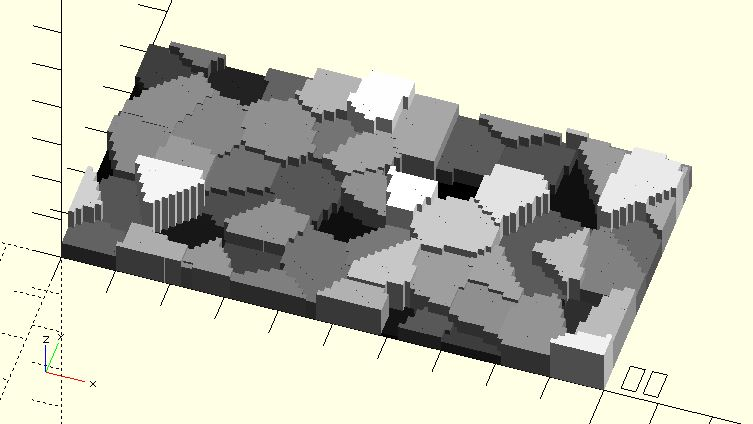

# nz_worley2s

Returns 2D [Worley noise](https://en.wikipedia.org/wiki/Worley_noise) values `[cell_x, cell_y, noise]` at (x, y) coordinates. 

It divides the space into grids. The nucleus of each cell is randomly placed in a grid. 

**Since:** 2.3

## Parameters

- `points` :  A list of `[x, y]` coordinates.
- `seed` :  The random seed. If it's ignored, a randomized value will be used.
- `grid_w` : The grid width. Default to 10. Smaller `grid_w` makes more cells.
- `dist` : The noise value of each point is based on its distance to other cells. Different distance strategies make different noises. The `dist` parameter accepts `"euclidean"`, `"manhattan"`, `"chebyshev"` or `"border"`.

## Examples

    use <noise/nz_worley2s.scad>;

    size = [100, 50];
    grid_w = 10;
    dist = "euclidean"; // [euclidean, manhattan, chebyshev, border] 
    seed = 51;

    points = [
        for(y = [0:size.y - 1]) 
            for(x = [0:size.x - 1]) 
                [x, y]
    ];

    cells = nz_worley2s(points, seed, grid_w, dist);

    for(i = [0:len(cells) - 1]) {
        h = norm([cells[i][0], cells[i][1]]) % 10;
        color([h, h, h] / 10)
        linear_extrude(h)
        translate(points[i])
            square(1);
    }

