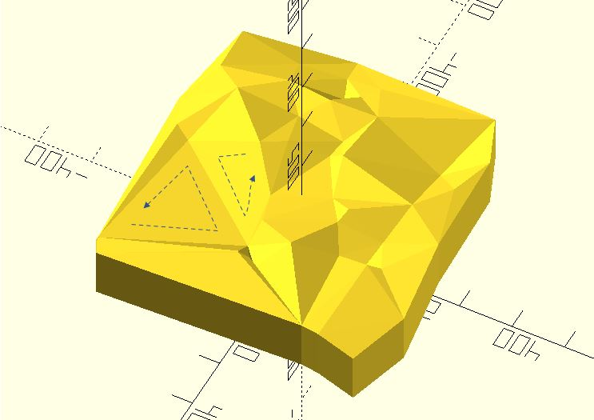

# sf_solidifyT

It solidifies two surfaces with triangular mesh. 

**Since:** 3.1

## Parameters

- `points1` : A list of `[x, y, z]`s.
- `points2` : A list of `[x, y, z]`s.
- `triangles` : Determine which points are connected by an edge. All triangles have points in the same direction, counter-clockwise. See examples below.

## Examples

    use <triangle/tri_delaunay.scad>;
    use <surface/sf_solidifyT.scad>;

    points = [for(i = [0:50]) rands(-300, 300, 2)]; 
    triangles = tri_delaunay(points);

    pts = [for(p = points) [p[0], p[1], rands(100, 150, 1)[0]]];
    pts2 = [for(p = pts) [p[0], p[1], p[2] - 100]];

    sf_solidifyT(pts, pts2, triangles = triangles);	

    use <triangle/tri_delaunay.scad>;
    use <surface/sf_solidifyT.scad>;

    thickness = .2;
    a_step = 10;
    r_step = 0.2;
    scale = 100;

    function f(x, y) = (pow(y,2)/pow(2, 2))-(pow(x,2)/pow(2, 2));

    pts2d = [
        for(a = [a_step:a_step:360])
            for(r = [r_step:r_step:2])
            let(
                x = round(r * cos(a) * 100) / 100, 
                y = round(r * sin(a) * 100) / 100
            )
            [x, y] 
    ];

    points1 = [for(p = pts2d) scale * [p[0], p[1], f(p[0], p[1])]];
    points2 = [for(p = points1) [p[0], p[1], p[2] - scale * thickness]];
    triangles = tri_delaunay(pts2d);

    sf_solidifyT(points1, points2, triangles);

