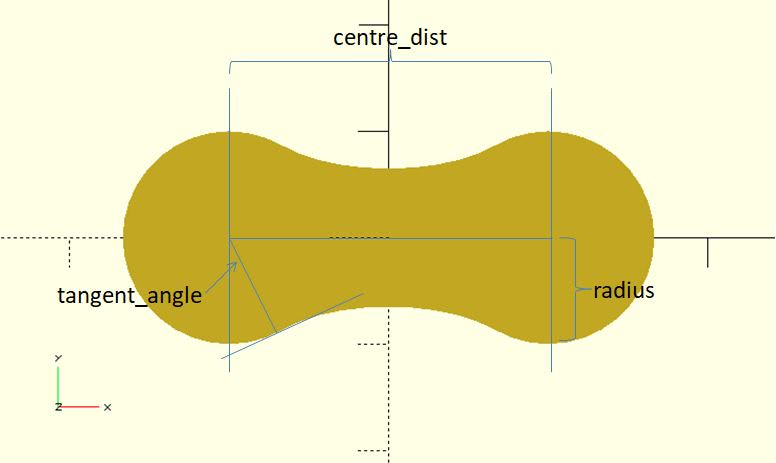
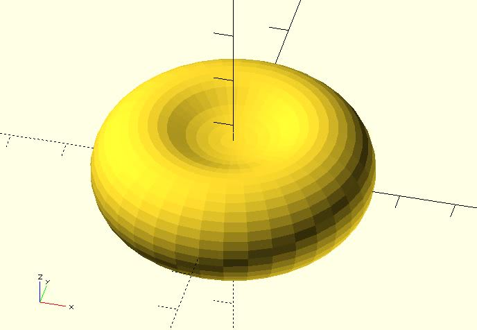
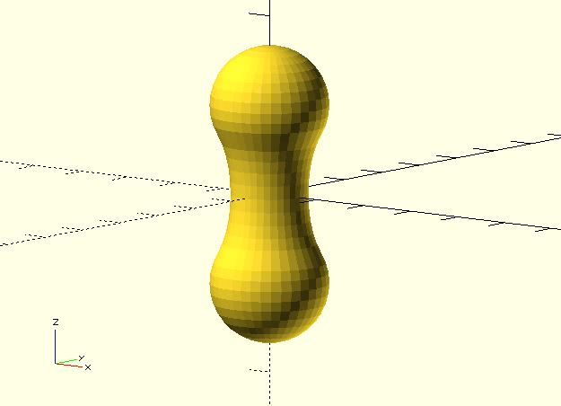

# shape_liquid_splitting

Returns shape points of two splitting liquid shapes, kind of how cells divide. They can be used with xxx_extrude modules of dotSCAD. The shape points can be also used with the built-in polygon module. 

**Since:** 2.5

## Parameters

- `radius` : The radius of two circles.
- `centre_dist` : The distance between centres of two circles.
- `tangent_angle` : The angle of a tangent line. It defaults to 30 degrees. See examples below.
- `t_step` : It defaults to 0.1. See [bezier_curve](https://openhome.cc/eGossip/OpenSCAD/lib3x-bezier_curve.html) for details.
- `$fa`, `$fs`, `$fn` : Check [the circle module](https://en.wikibooks.org/wiki/OpenSCAD_User_Manual/Using_the_2D_Subsystem#circle) for more details.

## Examples

    use <shape_liquid_splitting.scad>;

    $fn = 36;

    radius = 10;
    centre_dist = 30;

    shape_pts = shape_liquid_splitting(radius, centre_dist);
    polygon(shape_pts); 

    use <shape_liquid_splitting.scad>;

    $fn = 36;

    radius = 10;
    centre_dist = 30;

    shape_pts = shape_liquid_splitting(radius, centre_dist);
    width = centre_dist / 2 + radius;

    rotate_extrude() difference() {    
        polygon(shape_pts);    

        translate([-width, -radius]) 
            square([width, radius * 2]);
    }

    use <shape_liquid_splitting.scad>;

    $fn = 36;

    radius = 10;
    centre_dist = 30;

    shape_pts = shape_liquid_splitting(radius, centre_dist);

    width = centre_dist + radius * 2;

    rotate_extrude() 
        intersection() { 
            rotate(-90) polygon(shape_pts);    

            translate([radius / 2, 0]) 
                square([radius, width], center = true);
        }

