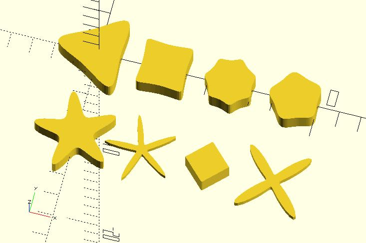
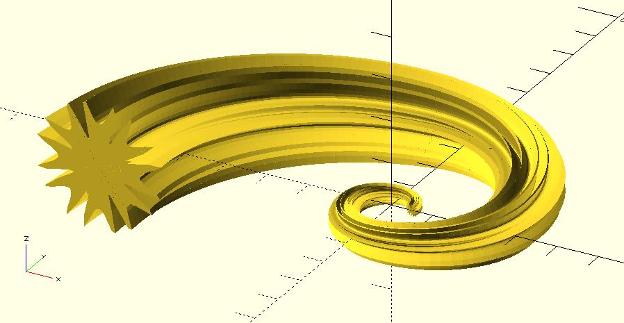

# shape_superformula

Returns shape points of a [Superformula](https://en.wikipedia.org/wiki/Superformula) shape. They can be used with xxx_extrude modules of dotSCAD. The shape points can be also used with the built-in polygon module. 

## Parameters

- `phi_step` : The phi step of Superformula.
- `m1`, `m2`, `n1`, `n2`, `n3`, `a`, `b` : The parameters of [Superformula](https://en.wikipedia.org/wiki/Superformula). The default value of `n2`, `n3`, `a`, and `b` is 1.

## Examples

    use <shape_superformula.scad>;   
        
    phi_step = 0.05;

    polygon(shape_superformula(phi_step, 3, 3, 4.5, 10, 10));

    translate([3, 0]) 
        polygon(shape_superformula(phi_step, 4, 4, 12, 15, 15));

    translate([6, 0]) 
        polygon(shape_superformula(phi_step, 7, 7, 10, 6, 6));

    translate([9, 0]) 
        polygon(shape_superformula(phi_step, 5, 5, 4, 4, 4));
        
    translate([0, -4]) 
    scale(0.8) 
        polygon(shape_superformula(phi_step, 5, 5, 2, 7, 7));

    translate([3, -4]) 
    scale(0.25) 
        polygon(shape_superformula(phi_step, 5, 5, 2, 13, 13));

    translate([6, -4]) 
        polygon(shape_superformula(phi_step, 4, 4, 1, 1, 1));

    translate([9, -4]) 
    scale(0.3) 
        polygon(shape_superformula(phi_step, 4, 4, 1, 7, 8));

    use <shape_superformula.scad>; 
    use <golden_spiral_extrude.scad>;  
        
    phi_step = 0.05;

    m = 16;
    n = 0.5;
    n3 = 16;

    shape_pts = shape_superformula(phi_step, m, m, n, n, n3);

    golden_spiral_extrude(
        shape_pts, 
        from = 5, 
        to = 10, 
        point_distance = 2,
        scale = 10
    );  

