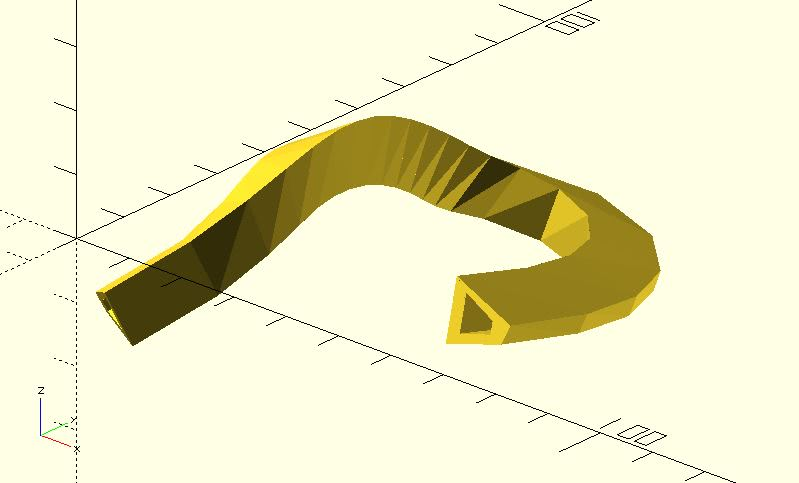
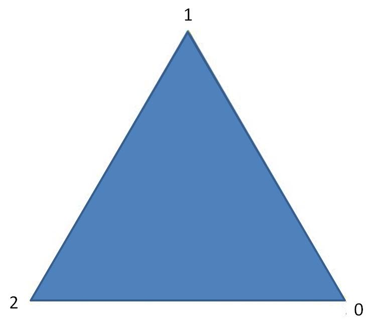
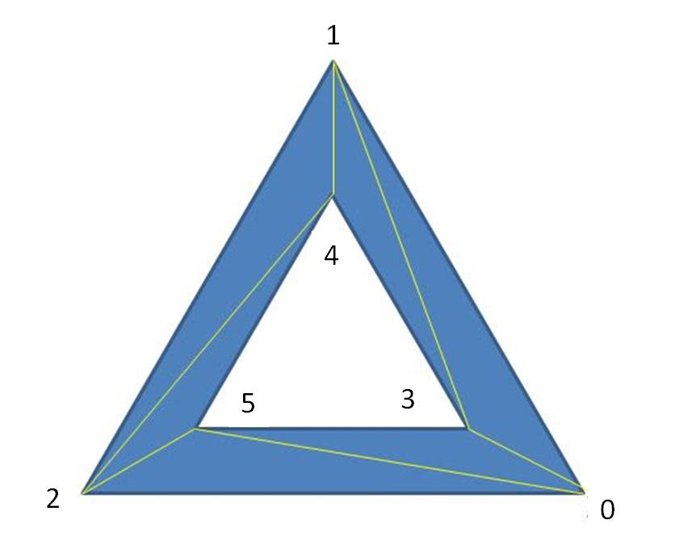
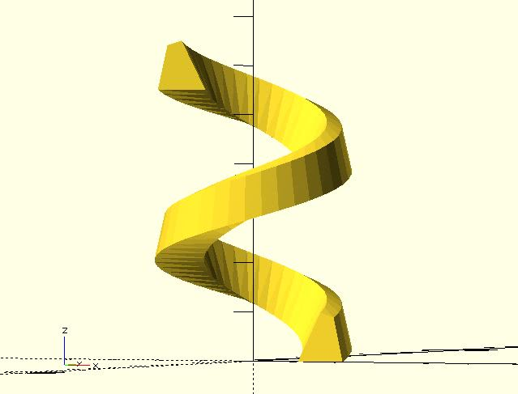

# sweep

This module sweeps multiple cross-sections to create a 3D object. For example, imagine that you have the following cross-sections:

This module sweeps them to create a 3D object:

When using this module, you should use points to represent a cross section. The points must be counter-clockwise indexes. For example:

If your cross section is hollow, set the `triangles` parameter to `"HOLLOW"` and index the points as the following:

You can cut triangles by yourself. For example, the above shape can be cut into triangles such as:

The indexes of the above triangles is:

    [
		[0, 3, 1],
		[1, 3, 4],
		[1, 4, 2],
		[2, 4, 5],
		[2, 5, 0],
		[0, 5, 3]
	]

**Since:** 2.3

## Parameters

- `sections` : A list of cross-sections. Each cross-section is represented by points. See the example below.
- `triangles` : `"SOLID"` (default), `"HOLLOW"`,  or user-defined indexes. See example below.

## Examples

	use <ptf/ptf_rotate.scad>;
	use <sweep.scad>;

	section1 = [
		[20, 0, 0],
		[18, 9, 0],
		[15, 10, 0],
		[10, 0, 0]
	];

	// spin section1
	sections = [
		for(i = [0:55]) 
			[
				for(p = section1)
					let(pt = ptf_rotate(p, [90, 0, 10 * i]))
					[pt.x, pt.y , pt.z + i]
			]
	];

	sweep(sections);

	use <ptf/ptf_rotate.scad>;
	use <sweep.scad>;
	
	section1 = [
	    // outer
		[20, 0, 0],
		[18, 9, 0],
		[15, 10, 0],
		[10, 0, 0],
	    // inner
        [18, 2, 0],
        [17, 7, 0],
        [15, 7, 0],
	    [12, 2, 0]
	];
	
	// spin section1
	sections = [
	    for(i = [0:55]) 
	        [
	            for(p = section1)
	                let(pt = ptf_rotate(p, [90, 0, 10 * i]))
	                [pt.x, pt.y , pt.z + i]
	        ]
	];
	    
	sweep(sections, "HOLLOW");

	use <ptf/ptf_rotate.scad>;
	use <sweep.scad>;
	
	section1 = [
	    // outer
        [30, 0, 0],
	    [15, 10, 0],
	    [10, 0, 0],
	    // inner
	    [26, 1, 0],
	    [15, 8, 0],
	    [12, 1, 0],        
	];
	
	// spin section1
	sections = [
	    for(i = [0:55]) 
	        [
	            for(p = section1)
	                let(pt = ptf_rotate(p, [90, 0, 10 * i]))
	                [pt.x, pt.y , pt.z + i]
	        ]
	];
	    
	sweep(
	   sections = sections, 
	   triangles = [
            [0, 3, 1],
            [1, 3, 4],
            [1, 4, 2],
            [2, 4, 5],
            [2, 5, 0],
            [0, 5, 3]
        ]
	);

