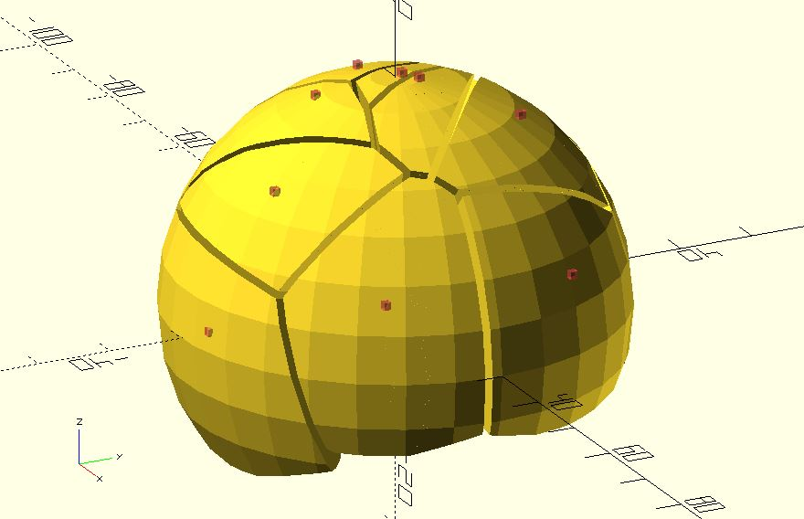
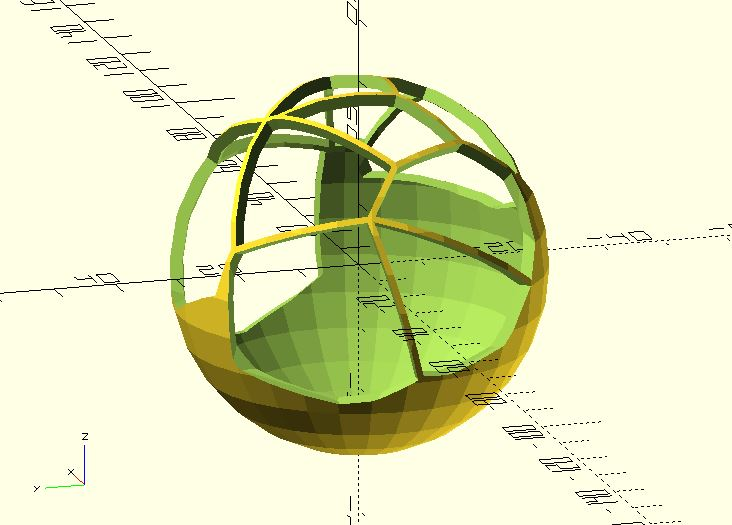

# vrn3_from

Create a 3D version of [Voronoi diagram](https://en.wikipedia.org/wiki/Voronoi_diagram).

**Since:** 2.4

## Parameters

- `points` : Points for each cell. 
- `spacing` : Distance between cells. Default to 1.

## Examples

    use <voronoi/vrn3_from.scad>;

    r = 30;

    zas = rands(0, 359, 12);
    yas = rands(0, 179, 12);

    points = [
        for(i = [0:len(zas) - 1])
        [
            r * cos(yas[i]) * cos(zas[i]), 
            r * cos(yas[i]) * sin(zas[i]), 
            r * sin(yas[i])
        ]
    ];

    #for(pt = points) {
        translate(pt) cube(1);
    }

    intersection() {
        sphere(r);
        vrn3_from(points);
    }

    use <voronoi/vrn3_from.scad>;

    r = 30;
    thickness = 2;
    
    zas = rands(0, 359, 12);
    yas = rands(0, 179, 12);

    points = [
        for(i = [0:len(zas) - 1])
        [
            r * cos(yas[i]) * cos(zas[i]), 
            r * cos(yas[i]) * sin(zas[i]), 
            r * sin(yas[i])
        ]
    ];
    
    difference() {
        sphere(r);
        
        render()
        scale(1.01) 
        intersection() {
            sphere(r);
            vrn3_from(points);
        }
        
        sphere(r - thickness);
    }    
    
