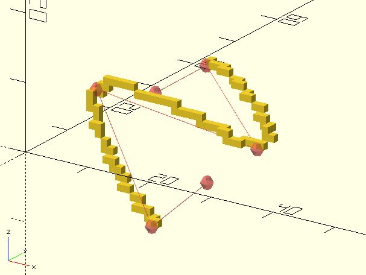

# vx_curve

Draws a voxel-by-voxel curve from control points. The curve is drawn only from the 2nd control point to the second-last control point. It's a voxel version of [curve](https://openhome.cc/eGossip/OpenSCAD/lib3x-curve.html). 

**Since:** 2.5

## Parameters

- `points` : A list of `[x, y]` or `[x, y, z]` control points.
- `tightness` : You can view it as the curve tigntness if you provide a value between 0.0 and 1.0. The default value is 0.0. See [curve](https://openhome.cc/eGossip/OpenSCAD/lib3x-curve.html) for details.

## Examples

    use <voxel/vx_curve.scad>;
    use <polyline_join.scad>;

    pts = [
        [28, 2, 1],
        [15, 8, -10],
        [2, 14, 5],
        [28, 14, 2],
        [15, 21, 9],
        [2, 28, 0]
    ];

    for(pt = vx_curve(pts)) {
    translate(pt)
        cube(1);
    }

    #for(pt = pts) {
        translate(pt)
            sphere(1);
    }
    #polyline_join(pts)
	    sphere(.05);  

